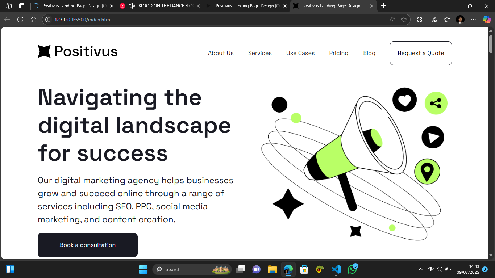

# Positivus Landing Page

A responsive landing page replication of the **Positivus** design as seen on [Figma](https://www.figma.com/design/hMZwiU8UmuRItpCxaj7yQi/Positivus-Landing-Page-Design--Community-?node-id=25-145&t=d7BEAAGZ2tfB8gCh-1), built using **HTML**, **CSS**, and **JavaScript**.

This project was created to practice front-end development and design implementation skills by replicating a modern landing page layout with interactive components.

---

## Live Demo

[View the Live Site Here](https://positivus-landing-page-navy.vercel.app/)

---

## Preview



---

## Tools & Technologies Used

- **HTML5** – Structure and semantics of the webpage  
- **CSS3** – Styling and layout (including Flexbox & Grid)  
- **JavaScript (Vanilla)** – Interactivity and behavior (e.g., mobile menu toggle)

<!-- --- -->

<!-- ## Project Structure
Positivus/
│
├── index.html # Main HTML file
├── /assets
│ ├── /img # Image files (e.g., logos, icons, illustrations)
| └── /styles
│       └── style.css # CSS styling
└── script.js # JavaScript for interactivity -->


---

## Features

- Responsive layout (mobile-friendly)
- Clean and modern UI replicated from Figma
- Navigation menu with hamburger toggle for mobile
- Modular and readable code structure
- Typography and color scheme faithful to original design

---

## Getting Started

To run the project locally:

1. Clone the repository:
   ```bash
   git clone https://github.com/EmmanuelPraise/Positivus.git
   ```

2. Navigate into the project folder:
```bash
cd positivus-landing-page
```
3. Open index.html in your browser.

---

## Learning Purpose
This project was built for the purpose of:
1. Practicing layout replication from a Figma file
2. Strengthening responsive web design techniques
3. Enhancing vanilla JS and DOM manipulation skills
4. Understanding how design translates into code

---

## Credits
Original Design: [Positivus Landing Page – Figma Community](https://www.figma.com/design/hMZwiU8UmuRItpCxaj7yQi/Positivus-Landing-Page-Design--Community-?node-id=25-145&t=d7BEAAGZ2tfB8gCh-1)

Developer: [EmmanuelPraise](https://github.com/EmmanuelPraise/)

---

## License
This project is for educational purposes only and is not for commercial use.

